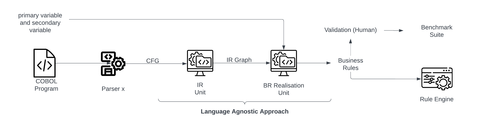
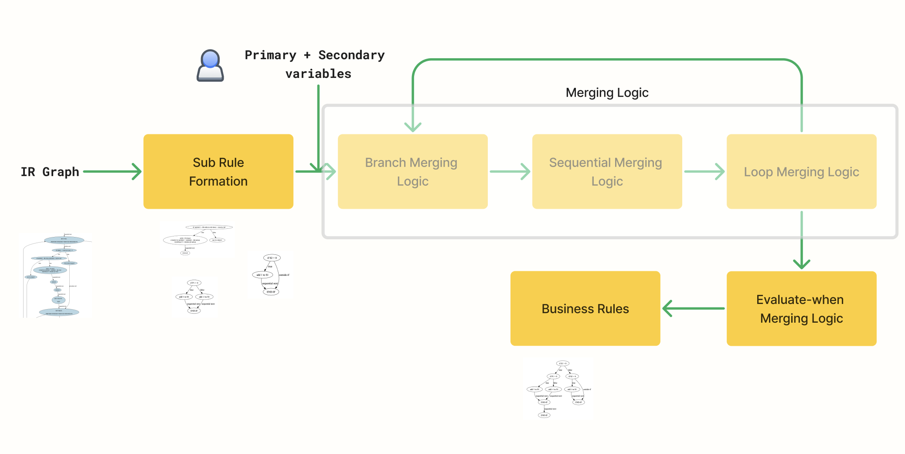
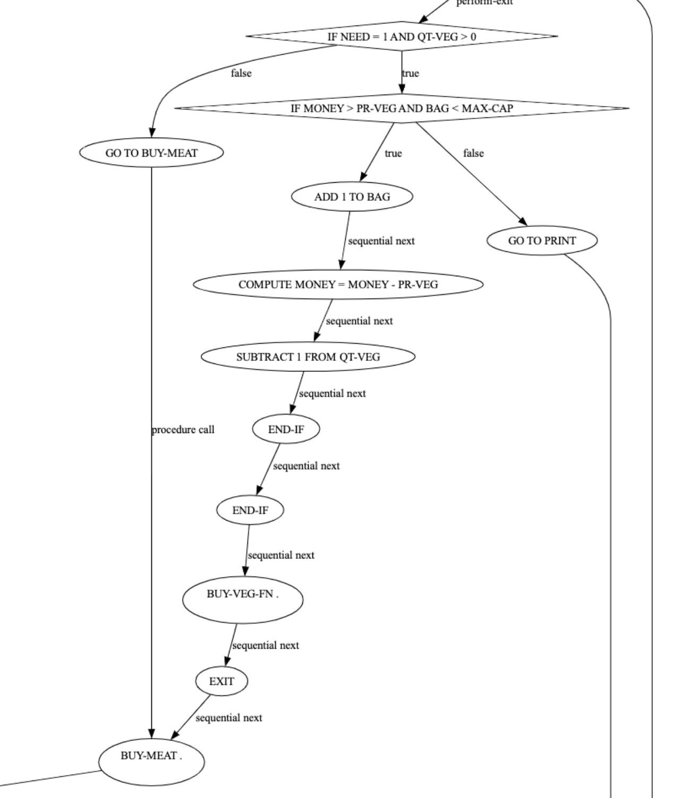
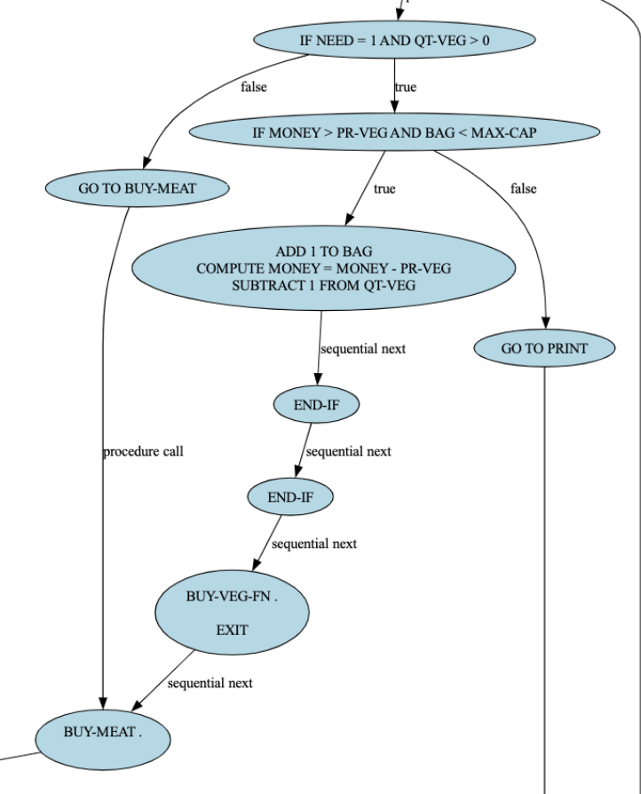
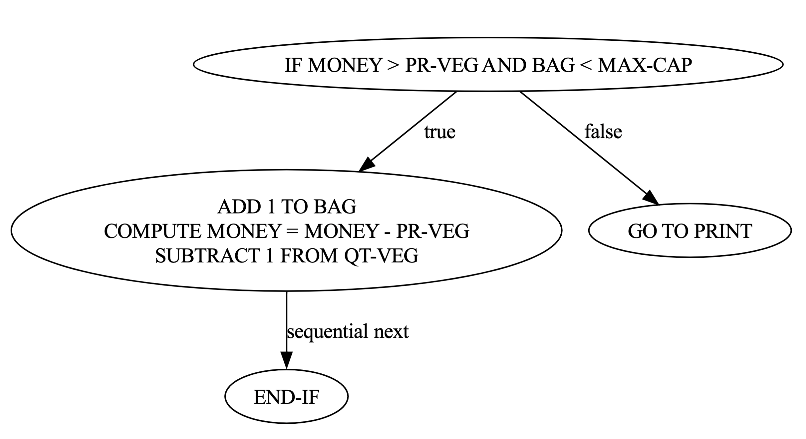
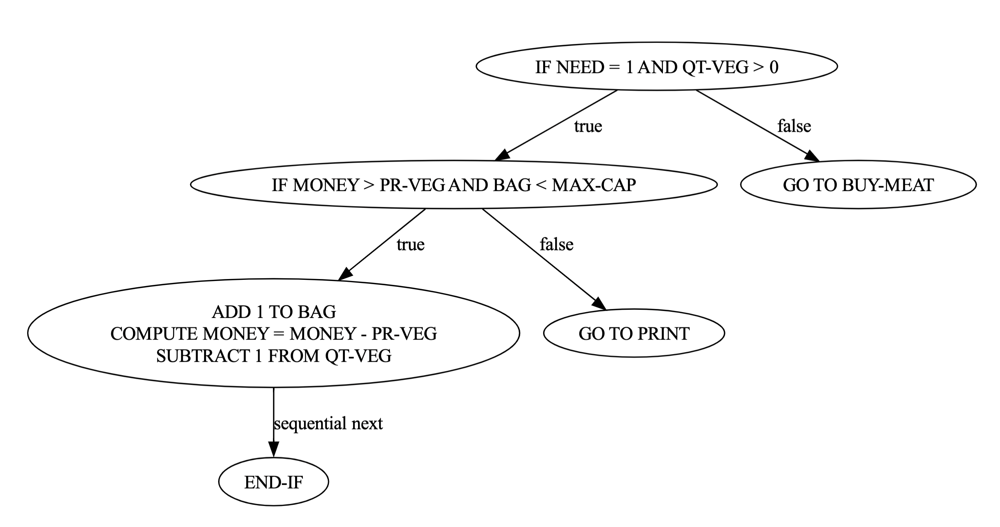

# Tool To Extract Business Rules From COBOL Programs
## Abstract and Motivation
In order to cater to the current requirements, there is an explicit need to take advantage of the latest technologies like multi-cloud, which requires the modernization of these legacy applications written in mainframe COBOL language. Among several aspects of modernization, Business rule or logic extraction is one of its major aspects. In general, the extraction of business rules can help with some of the basics of the code base, such as maintenance, evolution, and reuse. Hence, there is a need for our tool that can extract the business rules from a given code base. We also present the extracted Business Rules (BR) in a manner that they can be used by some down stream applications like rule engines.

## Features of Tool:
1. Constructs Control Flow Graph (CFG) of the input COBOL program.
2. Constructs Intermediate Representation Graph of the COBOL program.
3. Extracts the Business Rules embedded in the input COBOL program.
4. Our Tool outputs the CFG, IR, sub rules and rules in separate directories.

## Working of the Tool
Below figure shows our approach for Business Rule Extraction. We take COBOL source code as input, which is passed to the parsing unit for the purpose of Control Flow Graph(CFG) generation. Once, we have the CFG it is passed to the Intermediate Representation (IR) Unit, where we form the IR graph from the CFG, which would help us for extracting Business Rules (BR). Now the obtained IR graph, along with the primary variables and secondary variables set obtained from the user is passed down to the Business Rules Realisation Unit. This is the core part of our logic where we actually form rules. The obtained rules can  be consumed in the desirable manner.

The method of discovering and realising business rules in our approach is language agnostic. Until the same schema of the CFG is obtained rest of the units can function in the desired manner.

### 1. Parsing Unit ['ParsingUnit']
We used one of the unit of the COBREX tool to generate AST and then CFG from COBOL85 program. We modified their representation of CFG to make it more scalable and complete. Hence, this unit takes source code as input and generates CFG for the same.

### 2. Intermediate Representation Unit ['IRUnitGenerator']
This unit provides more abstract view of the CFG. It forms clusters of non control transfer and non control jump statements into one unit. 'IRUnitGenerator' is the directory which specifically does the task of generation of IR.

### 3. Business Rules Realisation Unit ['BR_Realisation']
This is the core of part of our tool. It contains two sub unit one for sub rule detection and other for rule formation. Rule formation sub unit is responsible for forming rule. Below is the overview of this unit's architecture.


## Output
For every unit we have a directory made under the parent directory with the name './output/COBOL_file_name'. Now based on the unit we generate CFG, IR, SubRule and Rule sub directories respectively.
Hence all the outputs are as follows:
    1. file_name_CFG.json, file_name_CFG.pdf
    2. file_name_IR.json, file_name_IR.pfd
    3. All the subrules, sr_i.pdf where i denotes ith subrule.
    4. All the rules, Rule_i.pdf where i denotes ith rule.
    5. BRR_file_name.pdf

## CFG generated and business rules extracted for [shop.cbl](./tests/shop.cbl)
### 1. A portion of generated Control Flow Graph (CFG)

### 2. Portion of IR

### 3. One of the Sub Rules

### 4. One of the Rule


## What's inside the COBREX-CLI repository?

In the root directory,

"extractor.py" is the starting point of execution.
"preprocessor.py" contains functions for preprocessing the COBOL program.
"issueTracker.xlsx" consists of the xcel sheet storing the evaluation details for iteration 1 and post implementation on iteration 1 results.

Inside the ProleapPreprocessor directory,

We have copied this directory as it is from the COBREX[1] code and need to confirm the usecase of the same.

Inside the ParsingUnit directory,

"main.py" contains the main method "extractor" used for generating CFG from the source code.
"cobol_analyzer.py" contains a class used to perform static analysis
on the input COBOL program. It is used to construct CFG.
"cobol_cfg.py" contains classes used for building the Control Flow Graph (CFG) of the COBOL code.
"procedure_visitor.py" contains classes used to extract information on procedures(paragraphs/sections) present in the COBOL program.
"data_division.py"  contains classes and code used to identify and store the variables present in the data division of the input COBOL program.
"model.py" contains support classes for building Control Flow Graph(CFG).
"business_rules_extractor.py: contains classes used to extract and visualize business  rules using the CFG and the business variables.
[We have taken this unit from COBREX[1] and modified it to the level we needed for the appropriate schema generation of CFG.]

Inside the IRUnitGenerator directory,

"baseUnit.py" base structure for the Atomic unit and precondition unit
"AtomicUnit.py" contains specific methods for the atomic unit definition
"PreconditionUnit.py" contains specific methods for precondition unit definitions
"IRBuilder.py" It contains the core logic for the formation of IR generation

Inside the BR_Realisation directory,

"baseRuleBox.py" abstract class for storing rule related various information.
"ruleHelper.py" contains the logic to form rule
"subruleHelper.py" contains the logic to form sub rules
"subRuleBox.py" class to store various sub rules
"utils.py" contains normal utility methods
"main.py" Maintains the flow of the BRR unit

## Installation of Tool:
1. Clone or download this github repository.

2. Get into the main directory:
```bash
cd COBREX-CLI
```

3. Create and activate a new python3 virtual environment:
```bash
python(3) -m venv <path_to_env/env_name></path_to_env>
```

4. Install the requirements:
```bash
pip install -r requirements.txt
```

5. Install [GnuCOBOL](https://gnucobol.sourceforge.io)
6. Install [Graphviz](https://graphviz.org/download/)


## Execution of the tool:

1. Fill the information of primary and secondary variables in the input.txt

2. Run extractor.py along with the input COBOL program file path:
```bash
python3 extractor.py input_cobol_file_path
```

3. Final output will be obtained in the output directory.

## References
[1]  M. S. Ali, N. Manjunath and S. Chimalakonda, "COBREX: A Tool for Extracting Business Rules from COBOL," 2022 IEEE International Conference on Software Maintenance and Evolution (ICSME), Limassol, Cyprus, 2022, pp. 464-468, doi: 10.1109/ICSME55016.2022.00060.
